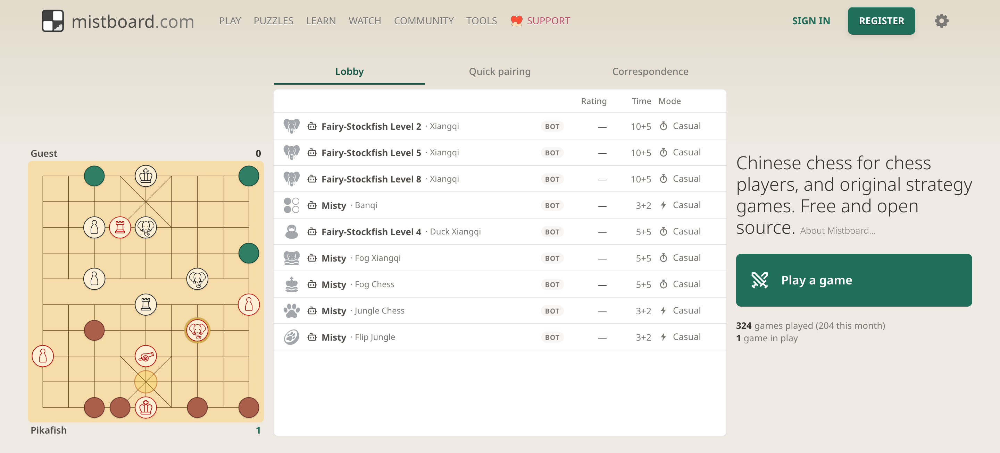

# [Mistboard](https://mistboard.com)

[](https://github.com/brianhliou/mistboard/actions/workflows/ci.yml)
[](LICENSE)



Mistboard is a free, open-source place for chess players to learn Chinese
chess, and home to the original strategy games we build.

Chinese chess here means xiangqi and its traditional relatives, Jieqi and Banqi.
Most places to play them online assume you already read Chinese. Mistboard is
built for the chess player who doesn't: pieces render as icons you can identify
before you can read 車 or 砲, rules and articles are written in English rather
than translated into it, and a beginner course starts from the first move.

Beside the traditional games sit the ones Mistboard invents: Duck Xiangqi, Fog
Xiangqi, and Fortress, with more in design. Each starts from a board people
already know and changes one thing, and each gets a rules page and
server-enforced play. Jungle Chess, Flip Jungle, and Fog Chess are live too.

The goal is a trustworthy open-source place to play, study, rank, and build
engines for xiangqi and its variants.

Mistboard is independent. It is not affiliated with lichess, chess.com, or any
other chess platform.

## Features

- Low-friction [PvP rooms](https://mistboard.com) with shareable room links and
  account-optional play, plus a lobby, engine opponents, and correspondence.
- Tactics puzzles mined from real games, and an analysis board that runs the
  engine in the browser.
- Mistboard TV, tournament broadcasts, and a games database of finished games
  from broadcasts, the archive, and play here.
- Rules pages for every variant, a beginner xiangqi course, and studies.
- Postgame replay from either player's perspective or full truth, with public
  game links and PGN and JSON export.
- Leaderboards, rating stats, a forum, a blog, and directories for coaches and
  streamers.
- A first-party engine track that uses the same redacted
  [`EngineTurnRequest`](docs/engine-protocol.md) boundary available to any
  third-party engine.

Live games are playable at [mistboard.com](https://mistboard.com), and the
video channel is [@Mistboard](https://www.youtube.com/@Mistboard). For active
work and known issues, see the
[GitHub issue tracker](https://github.com/brianhliou/mistboard/issues).

## Development

Prerequisite: Node.js 22 or newer.

```bash
npm install
npm run dev
```

Open `http://localhost:3000`.

`npm run dev` is persistent by default: it starts a local Postgres in Docker,
applies migrations, and runs the server + web pair with the live product
variants. No Docker? Run `npm run dev:memory` for the in-memory path
(DB-backed pages like `/watch` and profiles are dark).

Useful checks:

```bash
npm test
npm run typecheck
npm run verify -- --changed
```

Load the product-shaped local QA fixtures (public profiles, watch feed, live
variant sample games, plus an admin account, inbox threads, and a seeded
xiangqi ladder):

```bash
npm run db:seed:qa
```

See [CONTRIBUTING.md](CONTRIBUTING.md) for the contributor workflow, local test
matrix, and pull request expectations.

## Code

Mistboard is a small TypeScript npm workspace:

```text
packages/game           Pure game logic: types, rules, visibility, variants
packages/board-render   Shared SVG and browser board rendering primitives
apps/server             WebSocket rooms, clocks, event log, HTTP API
apps/web                Vite browser client, game screens, replay, learning UI
```

The server owns canonical `GameState`. Clients receive only a `PlayerView`, the
seat-scoped projection produced by the rules package. This is the core
hidden-information boundary: hidden pieces, hidden opponent moves, and live truth
state must never be sent to the wrong consumer.

The browser client is a no-framework [Vite](https://vitejs.dev/) build. Xiangqi
and the other intersection boards render through this repository's own SVG
board code in `apps/web` and `packages/board-render`; the 8x8 chess family uses
[chessground](https://github.com/lichess-org/chessground) for board interaction
and [chessops](https://github.com/niklasf/chessops) for chess primitives. The
server is a [Node.js](https://nodejs.org/) WebSocket process with
[Postgres](https://www.postgresql.org/) for the event log and game history.

See [docs/ARCHITECTURE.md](docs/ARCHITECTURE.md) for the full data flow and
state model.

## Documentation

- [docs/README.md](docs/README.md) is the public documentation map.
- Player-facing rules for every variant live at
  [mistboard.com/rules](https://mistboard.com/rules); the canonical rule logic
  and tests are in `packages/game`.
- [docs/ARCHITECTURE.md](docs/ARCHITECTURE.md) describes the state model and the
  hidden-information boundary.
- [docs/engine-protocol.md](docs/engine-protocol.md) documents the redacted
  engine protocol.

Use [GitHub issues](https://github.com/brianhliou/mistboard/issues) for bug
reports and feature requests.

## Contributing

See [CONTRIBUTING.md](CONTRIBUTING.md), [CODE_OF_CONDUCT.md](CODE_OF_CONDUCT.md),
and [SECURITY.md](SECURITY.md).

## License

AGPL-3.0-or-later. See [LICENSE](LICENSE).

For uses that require terms other than AGPL, such as closed-source
distribution, reach out via [mistboard.com/contact](https://mistboard.com/contact).

## Governance

Mistboard is founder-led. The code is open source, but the official project
identity, `mistboard.com`, hosted service, roadmap, and production
infrastructure remain controlled project assets.

See [GOVERNANCE.md](GOVERNANCE.md), [TRADEMARK.md](TRADEMARK.md), and
[docs/project-direction.md](docs/project-direction.md).
